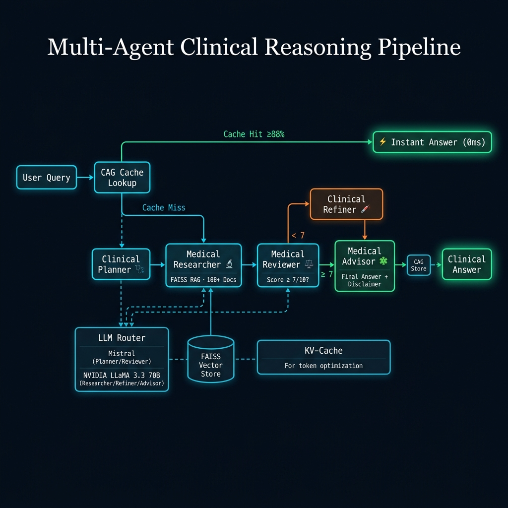

# ⚕️ Healthcare AI Clinical Assistant

A **multi-agent LLM system** specialised for healthcare clinical reasoning. Five AI agents collaborate through a LangGraph workflow to produce verified, evidence-based medical answers with built-in safety checks.

Features **Cache-Augmented Generation (CAG)**, **RAG with 100+ medical documents**, **KV-Cache optimisation**, and **real-time SSE streaming**.

## Architecture



<details>
<summary>Text version</summary>

```
User Query
    │
    ▼
┌─── CAG Lookup ──── Hit? ──→ Instant Answer (0ms)
│         │
│       Miss
│         ▼
│   Clinical Planner (Mistral)
│         │
│         ▼
│   Medical Researcher (NVIDIA LLaMA + FAISS RAG)
│         │
│         ▼
│   Medical Reviewer (Mistral) ── Score ≥ 7 ──→ Medical Advisor
│         │                                         │
│      Score < 7                                    │
│         ▼                                         │
│   Clinical Refiner (max 2 retries)                │
│         │                                         │
│         └── loops back to Reviewer                │
│                                                   ▼
└──────────────────────────────────────────→ Final Answer + Disclaimer
```
</details>

## Key Features

### Multi-Agent Clinical Pipeline
- **5 specialised agents** with distinct roles and optimal model assignments
- **Clinical Planner** → decomposes queries into differential diagnosis steps
- **Medical Researcher** → retrieves evidence from 100+ medical docs via FAISS
- **Medical Reviewer** → checks clinical accuracy, drug interactions, safety
- **Clinical Refiner** → corrects identified medical issues
- **Medical Advisor** → produces final answer with ⚕️ medical disclaimer

### Cache-Augmented Generation (CAG)
- Semantic response cache using cosine similarity (≥88% threshold)
- Returns instant answers for similar previously-answered queries
- Dual lookup: exact hash match + semantic similarity
- LRU eviction with max 500 entries

### Healthcare RAG (100+ Documents)
- **FAISS vector store** with sentence-transformers (all-MiniLM-L6-v2)
- **15+ medical specialties**: cardiology, neurology, endocrinology, oncology, emergency medicine, pharmacology, lab values, clinical reasoning, and more
- Persisted to disk at `./faiss_index/`
- Preloaded at server startup for zero-latency first queries

### KV-Cache Optimisation
- SHA-256 keyed prompt prefix cache
- LRU eviction (256 entries)
- Thread-safe with token savings tracking

### LatentMAS-Inspired Architecture
- Compressed inter-agent communication (~60% token reduction)
- Only the final Medical Advisor produces verbose output
- Per-agent token budgets: Planner 300, Reviewer 200, Refiner 500, Advisor 800

### Real-Time SSE Streaming
- Live agent progress tracking in frontend
- EventSource-based server-sent events
- Elapsed timer and agent status cards

## Getting Free API Keys

1. **Mistral AI** — [console.mistral.ai](https://console.mistral.ai)
   - Sign up → API Keys → Create new key
   - Free tier includes `mistral-large-latest`

2. **NVIDIA** — [build.nvidia.com](https://build.nvidia.com)
   - Sign up → API Keys → Generate key
   - Free tier includes `meta/llama-3.3-70b-instruct`

## Quick Start

### 1. Install dependencies
```bash
pip install -r requirements.txt
```

### 2. Configure API keys
```bash
cp .env.example .env
```
Edit `.env` and fill in your two free API keys:
```
MISTRAL_API_KEY=your_mistral_key_here
NVIDIA_API_KEY=your_nvidia_key_here
```

### 3. Run the CLI
```bash
python main.py --query "What is the first-line treatment for hypertension?"
```

### 4. Run with mock mode (no API keys needed)
```bash
python main.py --query "What are symptoms of diabetes?" --mock
```

### 5. Start the REST API + Frontend
```bash
uvicorn api.app:app --reload --port 8000
```
Then open `frontend/index.html` in your browser.

### 6. Run healthcare benchmarks
```bash
python eval/benchmark.py --mock
```

## API Endpoints

| Endpoint | Method | Description |
|----------|--------|-------------|
| `/query` | POST | Run a clinical query (body: `{"query": "...", "mock": false}`) |
| `/query/stream` | GET | SSE streaming with real-time agent progress |
| `/cache-stats` | GET | KV-Cache hit/miss/tokens-saved statistics |
| `/cag-stats` | GET | Cache-Augmented Generation statistics |
| `/health` | GET | Health check with model routing info |
| `/docs` | GET | Interactive Swagger UI |

## Project Structure

```
multi_agent_llm/
├── agents/
│   ├── planner.py          # Clinical Planner (Mistral)
│   ├── researcher.py       # Medical Researcher — RAG retrieval (NVIDIA LLaMA)
│   ├── critic.py           # Medical Reviewer — clinical accuracy check (Mistral)
│   ├── refiner.py          # Clinical Refiner (NVIDIA LLaMA)
│   └── solver.py           # Medical Advisor — final answer + disclaimer (NVIDIA LLaMA)
├── memory/
│   ├── medical_corpus.py   # 100+ curated medical documents (15+ specialties)
│   ├── vector_store.py     # FAISS vector store manager
│   ├── kv_cache.py         # KV-Cache (SHA-256 prompt prefix)
│   ├── cag.py              # Cache-Augmented Generation (semantic response cache)
│   └── context_compressor.py # LatentMAS compressed inter-agent communication
├── graph/
│   └── workflow.py         # LangGraph StateGraph orchestration + SSE streaming
├── router/
│   └── llm_router.py       # LLM factory + per-agent token budgets + mock mode
├── api/
│   └── app.py              # FastAPI REST interface + SSE endpoints
├── eval/
│   └── benchmark.py        # Healthcare benchmark (8 clinical scenarios)
├── frontend/
│   └── index.html          # Healthcare-themed UI with SSE streaming
├── main.py                 # CLI entrypoint
├── requirements.txt
├── .env.example
└── .gitignore
```

## Technologies

| Technology | Purpose |
|-----------|---------|
| Python 3.13 | Core language |
| LangGraph | Multi-agent state graph orchestration |
| LangChain | LLM abstraction layer |
| FAISS | Vector similarity search for RAG |
| Sentence-Transformers | Text embeddings (all-MiniLM-L6-v2) |
| FastAPI | REST API with SSE streaming |
| Mistral AI | LLM for Planner and Reviewer |
| NVIDIA LLaMA 3.3 70B | LLM for Researcher, Refiner, Advisor |

## Environment Variables

| Variable | Source | Required |
|----------|--------|----------|
| `MISTRAL_API_KEY` | [console.mistral.ai](https://console.mistral.ai) | Yes (unless `--mock`) |
| `NVIDIA_API_KEY` | [build.nvidia.com](https://build.nvidia.com) | Yes (unless `--mock`) |

## License

MIT
